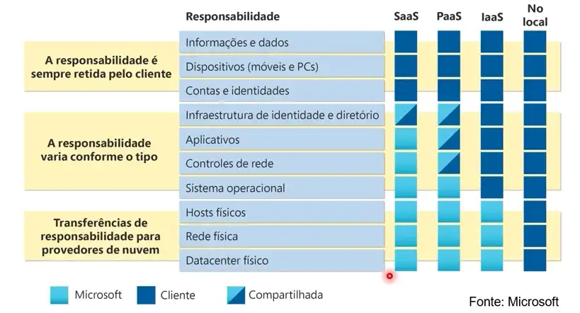
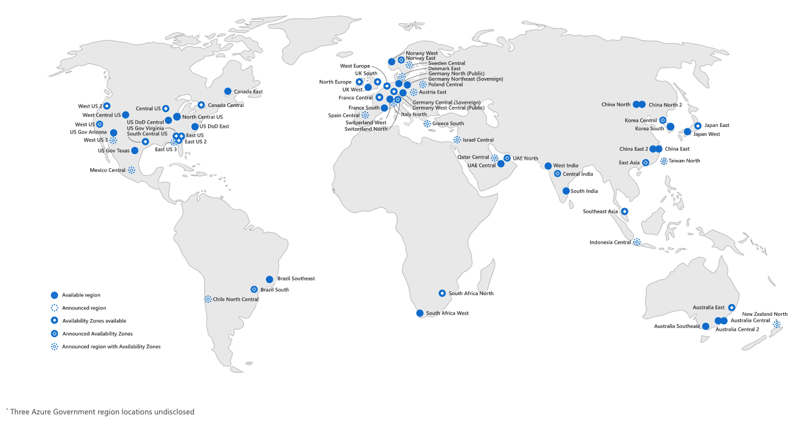
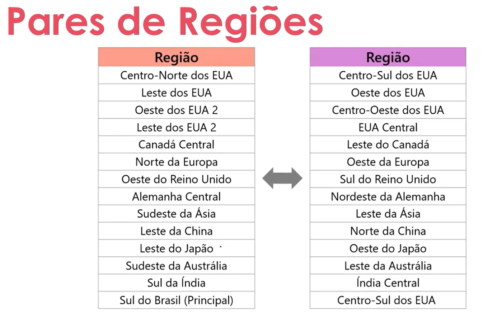

# Resumo do Curso AZ-900

## Contexto deste repositório

Resumo dos temas já abordados no curso **Formação Microsoft AZ-900 Certification**, cedido pela Digital Innovation One.

# Módulo 1 - O que é Cloud Computing?

## A origem da computação em nuvem

Antigamente, empresas que precisavam trabalhar com grandes quantidades de documentos e dados tinham que realizar investimentos significativos para criar um servidor próprio para armazenar essa grande quantidade de informações.

Com o passar do tempo, as demandas dessas empresas cresciam constantemente, tornando necessários grandes investimentos em equipamentos, infraestrutura e instalação de novos servidores.

Como resposta às dificuldades relacionadas à escalabilidade desses servidores, surgiu a **Computação em Nuvem (Cloud Computing)**.

***

## Cloud Computing

Consiste em servidores e recursos de hardware disponibilizados de forma virtual e acessados pela internet. Esses servidores ficam localizados em grandes Data Centers especializados e distribuídos mundialmente.
> Esses Data Centers disponibilizam não só uma equipe especializada na manutenção física dos servidores, como também dispõem de uma infraestrutura totalmente preparada para garantir o melhor funcionamento dos sistemas, assegurando sempre sua plena operação.

## Modelos de nuvem
Atualmente, temos três modelos de nuvem comumente utilizados pelas empresas:

### Nuvem Privada (On-Premise)
Este modelo refere-se a servidores físicos instalados dentro da própria empresa. Suas principais características são:

>*   As organizações criam um ambiente de nuvem em seu próprio datacenter.
>*   As organizações são responsáveis por operar os serviços que fornecem.
>*   Não fornece acesso a usuários fora da organização.
>*   Maior custo inicial, porém, após implementada, basta realizar manutenções quando necessário.

### Nuvem Pública

A **nuvem pública** consiste em uma plataforma gerenciada online, na qual é possível não apenas armazenar grandes quantidades de dados, mas também hospedar serviços e implementar políticas de segurança nos dispositivos.
>
>*   Pertence a provedores de serviços de nuvem ou hosting.
>*   Fornece recursos e serviços a várias organizações e usuários.
>*   É acessada via conexão de rede segura (geralmente pela internet).
>*   Possui uma vasta quantidade de ferramentas próprias concedidas pelo provedor (firewalls, MDMs, sistemas de análise de dados, acesso a aplicações do ecossistema etc.).
>*   Custo sob demanda.

 Toda a parte de manutenção fica a cargo da provedora do serviço de nuvem (o Data Center para a parte física e a provedora da plataforma para manutenções, atualizações de software, correções de segurança e melhorias de desempenho).

### Nuvem Híbrida

A **nuvem híbrida** consiste na adoção dos dois tipos de nuvem citados acima: privada e pública. Resumidamente, junta o melhor dos dois mundos.
>
>*   Maior escalabilidade sob demanda.
>*   Melhor gestão de recursos.
>*   Interoperabilidade.
>*   Custo variável.

### Multi-Cloud

O conceito de **multi-cloud** tem sido cada vez mais adotado por empresas de grande porte, que utilizam mais de um tipo de nuvem pública para hospedar seus dados. Apesar da complexidade na implementação, oferece maior redundância.
>
>*   Maior complexidade.
>*   Menor downtime (se um serviço falhar, outro assume).
>*   Maior custo.

***

## Custos Operacionais (CapEx & OpEx)

Dentro das possibilidades de implementação de nuvem, é importante entender os tipos de despesas:

### CapEx (Capital Expenditure)
 termo **CapEx** significa **Despesas de Capital** e refere-se aos gastos e uma empresa para aquisição, melhoria ou manutenção de um ativo fixo por longo prazo.

**Principais características:**
>
>*   Custos iniciais elevados.
>*   Exige tempo para implementação e para o investimento tornar-se operacional.
>*   São investimentos estratégicos e visam o longo prazo.
>*   Custos operacionais tendem a diminuir com o tempo.
>*   Ideal para aquisição, melhorias ou expansões.
>
No contexto de computação em nuvem, o **CapEx** representa o investimento necessário para construir a infraestrutura física de um servidor privado. É um custo elevado no início, mas tende a reduzir os gastos operacionais ao longo do tempo.

### OpEx (Operational Expenditure)

O termo **OpEx** refere-se às **despesas operacionais**, como assinaturas de licenças e outros custos recorrentes (salários, seguros, contas etc.).

**Principais características:**
>
>*   Não é um ativo, mas sim uma despesa.
>*   Custos recorrentes e, em alguns casos, variáveis.
>*   Geralmente exige menos tempo para tornar-se operacional.
>
No contexto de computação em nuvem, **OpEx** representa os custos da utilização das plataformas, que costumam cobrar mensalmente conforme os recursos utilizados.

***

# Benefícios da Nuvem

Quando falamos sobre nuvem, especialmente nuvens públicas, é inegável que elas oferecem um conjunto robusto de funcionalidades e ferramentas, tornando sua implementação uma vantagem significativa para empresas e profissionais de TI.

## 1. Alta Disponibilidade

Os serviços em nuvem possuem estrutura voltada para manter os sistemas sempre operacionais, seguindo práticas para mitigar impactos em casos de indisponibilidade.

Por padrão, as provedoras de nuvem tendem a ter contratos e uma série de padrões:

###  SLA (Service Level Agreement) e Créditos
>
>*   Os contratos incluem um **SLA**, que define a disponibilidade garantida (ex.: 99,9%).
>*   Se o provedor não cumprir, a provedora oferece créditos financeiros ou descontos (apenas em serviços voltados a nuvem).
>*   Exemplo: Em caso do servidor ficar indisponível por um tempo que passe do estimado no contrato de SLA, a provedora concede uma bonificação generosa de crédito como compensação.
>
>
### **Tabela de SLA e Tempo de Inatividade**

| **SLA (%)** | **Inatividade por Semana** | **Inatividade por Mês** | **Inatividade por Ano** |
| ----------- | -------------------------- | ----------------------- | ----------------------- |
| **99%**     | \~1h 40min                 | \~7h 18min              | \~3d 15h 36min          |
| **99,9%**   | \~10min                    | \~43min                 | \~8h 45min              |
| **99,95%**  | \~5min                     | \~21min                 | \~4h 22min              |
| **99,99%**  | \~1min                     | \~4min                  | \~52min                 |
| **99,999%** | \~6s                       | \~26s                   | \~5min 15s              |

### Comunicação e Transparência

>*   O provedor envia alertas e relatórios sobre incidentes.
>*   Publica atualizações em **status pages** (ex.: status.aws.amazon.com).
>*   Em casos críticos, pode haver contato direto com clientes corporativos.

### Recuperação e Continuidade

>*   Ativação de planos de contingência para restaurar serviços rapidamente.
>*   Uso de redundância geográfica para minimizar impacto.
>*   Em alguns casos, migração temporária para outra região.

### Suporte Técnico Prioritário

>*   Clientes com planos premium recebem suporte dedicado durante incidentes.
>*   Pode incluir engenheiros especializados para ajudar na mitigação.

### Relatório Pós-Incidente

>*   Após normalização, o provedor envia um relatório explicando:
>       -  Causa raiz do problema
>       -  Medidas corretivas para evitar recorrência
***

## 2. Escalabilidade

Capacidade de aumentar ou reduzir recursos conforme a demanda, garantindo desempenho e eficiência. A escalabilidade possibilitada pela Cloud Computing, de fato é o principal fator diferencial.

## 3. Elasticidade
A elasticidade refere-se a quando há um salto repentino acentuado na demanda, os recursos implantados podem ser expandidos(automaticamente ou manualmente).

Da mesma forma que os recursos podem ser expandidos, eles também podem ser reduzidos(automaticamente ou manualmente).

## 4. Confiabilidade

Devido ao design da nuvem ser descentralizado, isto é, ser disponibilizada em diversos locais. Acaba que sua infraestrutura oferece bastante confiabilidade e resiliência.

Pelo fato de seu design ser descentralizado, a nuvem nos permite a implantação de recursos em várias regiões do mundo.

## 5. Previsibilidade

A nuvem oferece muita previsibilidade, devido a não só o acompanhamento real de custo operacional da plataforma, como também o desempenho que possuí escalabilidade.
Mas sua previsibilidade também é bastante influenciada pelo **Microsoft Azure-Well-Architected Framework.**

## 6. Segurança
A nuvem oferece diversas ferramentas relacionadas a segurança, estas vão desde sistemas para autorizar/autenticar o acesso de usuários a até complexos sistemas de proteção em tempo real nos dispositivos…

Podemos citar alguns exemplos como:

### Entra ID (Antigo Active Directory)

>Sistema de autenticação/autorização de usuários do qual ajuda a proteger o acesso a aplicativos e recursos da Azure.
>
>A implementação não fica a cargo da Microsoft, cabendo a nós gestores/administradores, realizar a implementação.

### Microsoft Defender

>O Defender implementado na Azure oferece diversas ferramentas relacionadas à detecção de ameaças, integração com DevOps e gerenciamento de posturas de segurança.

### Microsoft Intune

>O Intune é a ferramenta responsável pelo gerenciamento de ponto de extremidade baseado em nuvem.
>
>Basicamente, é por ele que podemos implementar políticas de segurança nas máquinas. Privando os usuários de realizar ajustes inesperados ou até de instalar softwares/arquivos suspeitos.
>
>Podemos também realizar diagnósticos no dispositivo e até gerenciar em massa a implementação de atualizações, ajustes e diagnósticos…

Temos também a possibilidade de realizar a implementação de Firewalls no ambiente de nuvem e também realizar a implementação de uma VPN.

## 7. Governança

A auditoria baseada em nuvem nos ajuda a determinar responsáveis para a administração do ambiente em nuvem. 

Disponibilizando conjuntamente, ferramentas para diagnosticar se o ambiente como um todo está seguindo os padrões definidos pela auditoria e também, nos disponibilizando ferramentas e estratégias para mitigação de recursos fora de conformidade.

A plataforma também, dispõe de inúmeras automações que possam nos auxiliar na padronização de gestão da nuvem.

## 8. Gerenciabilidade

Um dos principais benefícios da computação em nuvem são as opções de capacidade de gerenciamento. Há dois tipos de capacidade de gerenciamento para computação em nuvem. 

Estes são:

### Gerenciamento da nuvem

O gerenciamento da nuvem diz respeito a gerenciar seus recursos de nuvem. Na nuvem, você pode:
>
>- Escalar automaticamente a implantação de recursos com base na necessidade.
>- Implantar recursos com base em um modelo pré-configurado, removendo a necessidade de configuração manual.
>- Monitorar a integridade dos recursos e substituir automaticamente os recursos com falha.
>- Receber alertas automáticos com base em métricas configuradas, de modo a ficar ciente do desempenho em tempo real.

### Gerenciamento na nuvem

Diz respeito à maneira de gerenciar seu ambiente de nuvem e seus recursos. Podemos gerencia-los por meio de:

>- Por meio de um portal da Web
>- Usando interface de linha de comando
>- Usando APIs
>- Usando PoweShell

## Tipos de Seviços de computação em Nuvem

Dentro da nuvem, temos três modelos de serviços disponibilizados com base na computação em nuvem, estes são:

### **IaaS (Infrastructure as a Service)**

Quando nos referimos a Infraestrutura como serviço, estamos nos referindo a infra-estrutura de hardware. Ou seja, Estamos utilizando recursos referentes a processamento, armazenamento, firewalls e demais recursos referentes a segurança de rede. 

Podemos citar exemplos como criação de VMs na Azure ou armazenamento utilizando o OneDrive
>*  Microsoft Azure Virtual Machines 
>*  Amazon EC2 (Elastic Compute Cloud) 
>*  Google Compute Engine – Infraestrutura escalável para rodar VMs no Google Cloud.
>*  IBM Cloud Virtual Servers – Máquinas virtuais com recursos configuráveis.
>* Oracle Cloud Infrastructure (OCI) – Infraestrutura para workloads corporativos.
>
 Por consequência, seus ajustes ficam totalmente a cargo do usuário/contratante
>

***

### **PaaS (Platform as a Service)**

Plataformas como serviços normalmente são plataformas das quais são distribuídas através de licenças/assinaturas. Estas mesmas costumam já serem construídas com um conjunto repleto de ferramentas. Bastando ao usuário, apenas utiliza-la e ajustar o ambiente conforme suas preferências.

>*  Microsoft Azure App Service
>*  Google App Engine 
>*  Heroku
>*  AWS Elastic Beanstalk
>*  IBM Cloud Foundry 
>*  Oracle Cloud Application Container

Para clara compreensão, Quando estamos falando de uma Plataforma, trata-se de uma Plataforma completa para desenvolvimento e execução. Fazendo-se desnecessária a necessidade de gerenciar servidores ou sistemas operacionais. Nos permitindo apenas focar no trabalho a ser feito. Como por exemplo, desenvolvimento, gerenciamento de database, análise de negócios e etc...

***

### **SaaS (Software as a Service)**

Quando nos referimos a SaaS, estamos nos referindo a um modelo de aquisição/utilização de um software onde não esteja relacionado a compra das licenças, sendo assim, utilizamos o software e pagamos por sua utilização.

Como exemplos práticos, podemos citar:
>*  Microsoft 365 (Word, Excel, Outlook online)
>*  Google Workspace (Gmail, Google Docs, Google Drive)
>*  Dropbox 
>*  Slack 
>*  Netflix 

 Resumindo, São os Aplicativos hospedados...

***

## Modelo de responsabilidade compartilhada

O modelo de responsabilidade compartilhada na nuvem refere-se a quem é responsável por quê entre o **provedor de nuvem** e o **cliente**,
dependendo do tipo de serviço em questão (IaaS, Saas, PaaS).

>* A princípio, toda a questão de **infraestrutura física, segurança do datacentr, hardware, sistema operacional, plataforma e demais manutenções físicas** ficam a critério do provedor de nuvem.
>
>* O cliente é responsável pela configuração, dados, identidade, acesso e aplicações.

Segue abaixo uma tabela ilustrativa mostrando melhor a questão de responsabilidade quanto aos serviços de nuvem.

Com base na tabela acima, podemos resumir que

### **IaaS**
>* Serviço de nuvem mais flexível
>* Cliente configura e gerencia o hardware para seu aplicativo.

### **PaaS**

>* Focado no desenvolvimento de aplicativos.
>* O gerenciamento de plataforma é realizado pelo provedor de nuvem.

### **SaaS**

>* Modelo de preço de pagamento conforme o uso. (Vale a alusão a licenciamentos)
>* Os usuários pagam pelo software que utilizam em um modelo de assinatura

*** 

# Módulo 2 - Arquitetura e serviços do Azure

## Regiões de disponibilidade

A Azure está em constante expansão, como podemos ver no mapa abaixo. A mesma já está disponível na maioria dos continentes.

>Podemos notar nas legendas da imagem, que alguns pontos são zonas e outros pontos são regiões. A diferença entre eles consiste em:

###  **Zona/Zona de Disponibilidade**

Quando estamos nos referindo a uma zona, estamos nos referindo a um data center físico independente dentro de uma região.

* Geralmente, uma **região** possuí 3 zonas (1 Região = 3 Data Centers)
* Cada zona tem sua própria energia, refrigeração e rede, garantindo alta disponibilidade.
* Se você implantar recursos em **zonas diferentes**, aumenta a tolerância a falhas.
> Caso aplicarmos a mesma analogia citada anteriormente, Podemos considerar que neste caso, estamos nos referindo ao prédio individualmente.

### **Região**

A **região consiste em um conjunto de data centers** localizados em uma área geográfica específica.
* Cada região do Azure é composta por múltiplas zonas de disponibilidade (quando disponíveis).
Exemplo:
    East US, Brazil South, West Europe
* Eles fornecem flexibilidade e escala para reduzir a latência do cliente.
* As regiões preservam a **residência de dados** com uma oferta abrangente de conformidade.
* A utilização da redundância é essencial para garantir a disponibilidade dos dados. Dessa forma, caso uma das zonas dentro da mesma região fique indisponível por qualquer motivo, ainda será possível acessar os dados por meio de outra zona dessa região.

> Vale a analogia de considerar a região como uma cidade que abriga vários prédios (data centers)

> Quando nos referimos a **residência dos dados**. Estamos nos referindo a localidade geográfica dos dados, ou seja, onde estes dados, estão físicamente localizados. Sendo assim, estamos nos referindo a região onde eles estão replicados.

## Pares de regiões
Um dos principais meios de prevenção para falhas catastróficas, é a utilização dos pares de regiões. Estes pares de regiões possuem como características principais:
> * No mínimo 300 milhas de separação entre pares de regiões. 
> * Replicação automática para **alguns serviços**.
> * Recuperação de região priorizada em caso de interrupção.
> * As atualizações são distribuídas sequencialmente para minimizar o tempo de inatividade.
> * Vale observar que os dados continuam na mesma geografia que seu par, por fins de jurisdição do imposto e aplicação da lei.
> * Estas regiões tem pares pré-determinados, seguindo a tabela abaixo:

## Disaster recovery

Quando a região principal não estiver disponível, podemos recorrer ao uso do **Disaster Recovery**. Esse conceito consiste em manter réplicas dos recursos essenciais em outra região, garantindo maior resiliência e continuidade dos serviços em caso de desastres que possam tornar a região original indisponível.
>A região utilizada como redundância para a região principal, é a sua região par. Seguindo a tabela de Pares de Regiões.

***

## Zonas soberanas
Zonas soberanas são ambientes de nuvem projetados para atender às normas e regulamentações locais do país ou região onde estão hospedadas. Elas foram desenvolvidas principalmente para cumprir requisitos rigorosos de soberania digital, garantindo que dados e serviços permaneçam sob controle jurisdicional adequado.
Esses ambientes são indicados para organizações governamentais e entidades públicas que necessitam de maior proteção e conformidade.
As zonas soberanas fazem parte da iniciativa Microsoft Sovereign Cloud, que combina a infraestrutura global do Azure com controles adicionais para assegurar conformidade com leis locais e oferecer proteção avançada aos dados.

### Azure Governamental (Azure Government)

Versão específica para uso governamental, apresentando diversas características específicas voltadas à segurança e conformidade dos dados. Como diferenciais a destacar, podemos citar:

>* Ambiente isolado 
> Infraestrutura separada da nuvem pública da Azure, garantindo uma maior segurança no ambiente como um todo.
>
>* Conformidade rigorosa
> Atende normas como FedRAMP, DoD, CJIS, HIPAA, entre outras.
>
>* Residência dos dados
> Todos os dados permanecem dentro da jurisdição dos EUA (para Azure Government) com acesso restrito a pessoal autorizado.
>
>* Serviços equivalentes ao Azure Público 
> Oferece uma quantia de serviços equivalentes ao Azure público, porém, apresenta alguns serviços a mais voltados à segurança e compliance.

### Azure China
O Azure China é uma instância separada da nuvem Microsoft Azure, criada para operar dentro das regulamentações chinesas. Ele é o único serviço de nuvem estrangeiro presente na China, mas para isso, segue algumas condições específicas:

>* Gerenciamento e operação
Todo o ambiente é operado e regulamentado pela empresa 21Vianet, conforme exigido pelas leis locais.
>
>* Políticas próprias de residência de dados
Os dados permanecem dentro da jurisdição chinesa, seguindo regras de soberania digital.
>
>* Ambiente isolado 
É separado da nuvem pública global do Azure, garantindo conformidade com normas de segurança e privacidade da China.
>
>* Serviços equivalentes ao Azure global, mas adaptados para atender às exigências regulatórias locais.

*** 

# Recursos do Azure    

A Azure dispõe de diversos recursos em nuvem, estes podendo ser recursos de rede, armazenamento em nuvem, computação em nuvem, IA, segurança, hospedagem de serviços, APIs e mais uma infinidade de possibilidades. São tantos recursos que para gerencia-los de forma individual. Surgiu uma nova forma de gerencia-los de forma unificada. Esta forma seriam os **Grupos de recursos**.

## Grupos de recursos

Grupos de recursos nada mais são como uma forma de unificar diversos recursos em um só ambiente.

* O Grupo de recursos (Resource Group) nos permite unificar todo um ambiente em um só grupo de recursos. Ex: Web, BD, VM e Armazenamento

* Podemos também criar um Grupo de recursos para cada função, por exemplo:
>    * Um Grupo só para Web e Banco de dados
>    * Um Grupo apenas para Máquinas virtuais
>    * Um Grupo somente para recursos de armazenamento

### Algumas observações sobre os Grupos de Recursos
* Os recursos podem existir em apenas um grupo de recursos
* Os recursos podem existir em diferentes regiões

* Podemos migrar os recursos para outros grupos, caso preciso.

* Não podemos renomear os Grupos de Recursos

* Quando apagamos um grupo Grupo, apagamos todos os recursos e configurações que estavam préviamente configurados dentro dele.

*** 

## Contas e Assinaturas na Azure

No contexto de Contas e Assinaturas do Azure, existe uma hierarquia bem definida.

No topo, temos a conta principal, que atua como Administrador Global do ambiente. Logo abaixo, existem duas contas de cobrança, responsáveis pela gestão financeira.

Essas contas de cobrança têm como função principal administrar as assinaturas dos demais usuários, além de realizar o controle detalhado dos custos da plataforma de nuvem. Como os serviços da Azure são sob demanda, a plataforma oferece diversos recursos para um gerenciamento financeiro preciso e eficiente.

Seguindo essa lógica hierárquica, abaixo das contas de cobrança estão as contas dos usuários. Nelas, toda a parte de licenciamento, gerenciamento e ajustes já foi previamente configurada pelo nível superior, garantindo que os usuários possam utilizar os recursos de forma adequada.

